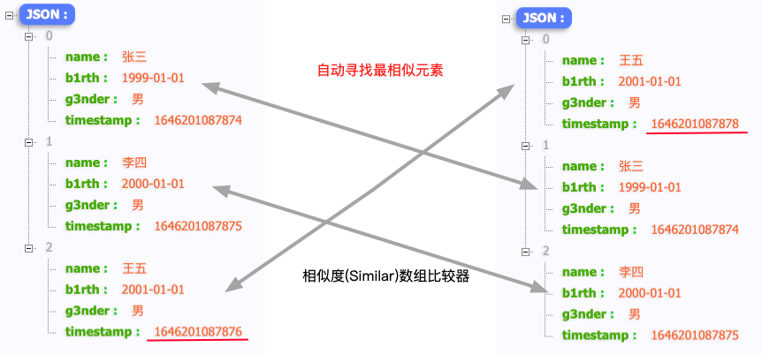

JsonDiff介绍
=================
#### JsonDiff提供了对Json通用的diff能力，多种算法模型满足对Json比较时各种不同的需求。同时JsonDiff也支持自定义算法、算法模型可配置、噪音字段过滤、自定义比较字段等多种通用功能。

## 1.JsonDiff是什么

JsonDiff可以对输入的两个<u>Json字符串</u>进行差值比较，利用diff算法得到<u>差异化最小的比较结果</u>。diff结果会展示2个Json字符串中不同结果的值、路径以及修改类型。

例如：
- 输入：
  ```json 
    jsonA: {"name":"张三","phon3":"12345678901","g3nder":"男","timestamp":"1646201087874"}
    jsonB: {"name":"张三","b1rth":"2000-01-01","g3nder":"男","timestamp":"1646201087875"}
  ```
- diff结果：
    ```json
    [{"diffType":"DELETE","left":"12345678901","leftPath":"phon3"},{"diffType":"MODIFY","left":"1646201087874","right":"1646201087875","leftPath":"timestamp","rightPath":"timestamp"},{"diffType":"ADD","right":"2000-01-01","rightPath":"b1rth"}]
    ```

## 2.diff的算法模型

json的比较算法可以抽象为针对四种json基本结构的比较（JsonArray,JsonObject,JsonNull,JsonPrimitive），因此json-diff主要抽象了以下四种比较器能力以及默认实现。

>> |  基本结构   | 算法模型 |  实现  |
>> |  ----  | ---- |----  |
>> | JsonObject  |ObjectComparator | 针对对象类型的比较  |
>> | JsonArray  | ArrayComparator | 针对数组类型的比较  |
>> | JsonPrimitive |PrimitiveComparator |  针对基本类型的比较|
>> | JsonNull  |NullComparator  | 针对NULL的比较   |

## 3.features

- ①**JsonObject比较时，忽略噪声字段**
- ②**JsonObject比较时，仅比较第一个json的所有属性（项目重构时一般只关注新街口是否完全覆盖老接口，新街口多字段无所谓）**
>   
  
- ③**JsonArray比较时，严格按照顺序比较**
>  
- ④**JsonArray比较时，根据相似度匹配比较**
> 
- ⑤**JsonArray比较时，按照某个主键字段匹配比较（withSpecialPath）,例如比较<u>name</u>都是<u>张三</u>的数据**
>   
    
- ⑥**织入自定义算法**


## 4.diff的使用方式

##### 步骤1：构造Diff入口
- 简单构造（全部使用默认算法）：Diff diff = new Diff();
    ```java
    Diff diff = new Diff();
    ```
- 灵活选择比较算法组合：
  ```java
    new Diff().withObjectComparator(objectComparator).withArrayComparator(arrayComparator).withPrimitiveAlgorithm(primitiveComparator).withNullComparator(nullComparator)
  ```
##### 步骤2：执行diff
    
- 严格比较两个json字符串是否相等
    ```java
    diff.diff(jsonA, jsonB)
    ```
- 过滤字段
    ```java
    diff.withNoisePahList(noiseList).diff(jsonA, jsonB)
    ```
    **路径设置说明**：字段路径中包含数组路径时，如"[0].name"，自定义路径忽略数组索引号，设置成"name"即可。
- 数组比较时，指定主键字段
    ```java
    diff.withSpecialPath(specialPath).diff(jsonA, jsonB)
    ```

5、第三方依赖
-----------------
>
> |  包   | 含义  |
> |  ----  | ----  |
> | gson包  | 用于解析json最基础的工具类 |
> | guava包  | 用于字符串拼接、集合合并、字符串转换等功能的工具类 |
